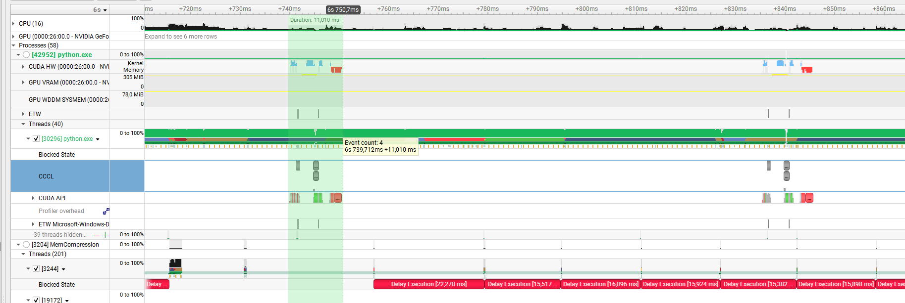

# Optimisation Documentation

There are various improvements made in the separte files (`triangulation.cu`, `voronoi.cu`), these are then also implemnted in the combined version (`incremental.cu`).

Profiling run on a `RTX 2060` using the 1024x1024 grid with 100_000 seeds

## `voronoi.cu`
### Explicit shared memory usage
Since each thread needs to read from its 4 neighbour cells, to determine the nearest seed, there is a lot of overlap for memory reads.
To improve that, each thread loads its cell into a shared memory, so the entire block has fast access to all neede cells. Additionally a halo of 1 cell around the blocks section is loaded, for the cross-block section reads in the neighbour check.
It is also loaded as a `Cell alignas(8)`, so it can be 1 64bit load, instead of 2x32bit.

**Performance difference**: 
~270us for the slowest kernel (from 514us)

### more efficient masking
1. Split the grid into tiles of 32x32
2. Each row has 1 uint32_t as a mask (one bit per thread), tracking if the last iteration, changed the cell (`0b1`)
3. Checks if any of our neighbours have changed their value, the previous iteration (bit set). This is especially efficient, because each warp checks the same i32 for the above and below check, because the entire thread reads the same i32.
4. Only if any neigbours changed, does it do the read the cell and find the best new option
5. Check if any thread in the warp has updated its value using `__syncthreads_or(changed)` (first wanted to do that in software using atomicOr, but found this hardware option)
    - Only if it changed, does 1 Thread per warp write the global updated flag
6. Populate the updated bits for the warp using `__ballot_sync(0xFFFFFFFFu, changed)`, which returns a bitmask of every thread that has changed == true
7. 1st thread in warp writes the mask

**Performance difference**: 
saving ~140us for the slowest run, however at the cost of the later runs taking a bit longer
~200us per entrire bfs run

### Early exit/dont load cells
Based on the masking from earlier, it is very easy to discard the entire block
Since we have 32 threads / block = 1 warp and every thread marks the mask with 1 if it updated, it is trivial to check if any bit is set (`mask != 0`).
1. The corner threads in read the neighbour mask, and `|` or them with their own mask.
2. If no thread has a 1 in any mask (`!__syncthreads_or(own_mask != 0u)`), we can exit early and do not need to load the cells into shared memory and skipp all of the later checks.

**Performance difference**: 
~100us per entire bfs

### Multiple dispatch before flag checking
Another bottleneck, that was visible in Nsight system, is the back and forth copy of the flag, which always stalled the GPU pipeline. To resolve this, it now runs multiple iterations of the step kerenl, before copying and checking the flag. This required 2 flag to ping pong btween.

**Performance difference**: 
~70us per iteration not checked (kernel runtime: 90us, even less for later kerens, what laready diverged more)


## `triangulation.cu`
This is where the biggest GPU improvement was.
It is basically a complete rewrite.

### assing triangle algorithm change
The old algorightm did the following:
1. 1 thread per pixel, within a window around that pixel, collect all unique seed IDs
2. For all seed IDs found:
    1. For all triangles that have that Seed as a corner:
        1. Load the tirangle data from the csr
        2. Test if the pixel is acutally inside the tirangle
        3. If the triangle ID is greater than the current one, track it.
3. Write the best ID into the grid

This approach is very slow, a lot of memory needs to be loaded, in the seed ID gathering, and a lot of unnecessary
triangles are checked.

What this kernel is really doing, is software rasterizing the tirangles too a buffer.

So the better approach, that I used does, basically the following:
1. Initialize outgrid with sentinal value -1 (lower than all valid Tri IDs)
2. 1 block per Tri (for now)
3. load the Triangle data (same across mutltiple threads > fast)
4. compute the AABB of the triangle
5. iterate over the AABB, in a flattened, strided manner, so cosecutive threads work on consecutive pixels
    1. If the pixel is inside the tri: AtomicMax tri ID with the current value
6. For the output check if the pixel is still the sentinal, if yes, use the default value

This is dramatically more efficient. I futhermore split the work, so a block works on multiple triangels at a time. So that every thread has to a few pixels in total.
N_Tir/Block and N_threads/Tri Balanced for atomicMax contention and memory limitation.

The AtomicMax makes sure the outcome is the same as in the old implementation. Only case where it could differ, is when in the original impl. the unique buffer would overflow and it would not track some Tris correctly. However, in that case, the new apprach is actually more accurate.

This also has the advantage, that no csr needs to be built.
The csr was perviously computed on the CPU, so the buffers had to be copied over, updated and reuploaded. This whole step is no longer necessary.

Removing the and crs, also saves a lot of allocations on GPU and CPU. The entire state lives on the GPU. The only download is for the output.

**Performance difference**: 
worst case (full triangulation): ~49381us = ~4.9ms
(old) best case: ~230us bestcase

### build_output kernels
Since the entire state lives on the CPU, the outputs can also be assembled directly ony the gpu, and then only needs to be copied to the host. No more iteration necessary on the host.

### Split RawTriangle/HTriangel
The old implementation use a monolithic struct with 5 i32 values (x,y,a,b,c,a_orig,b_orig,c_orig). However, they were never accesed all together. So I split them up to make more of them fit in cache:
- Vec2i(x,y)
- Vec3i(a,b,c)
- Vec3i(a_orig,b_orig,c_orig)
This also had the advantage, that sorting/uniqueing them using thrust::sort_by_key got slightly faster.

**Performance difference for sort**: 
avg. ~0.4ms faster
Difference for other kernels not directly measureable, since other restructures obscure it.

### GPU/CPU parallelisaiton
Since all the work is now done on the GPU, the main bottleneck, is the allocation of the output buffers. In the range of ms for the $1024^2*3*4 Byte$ on my machine. So while the slowes task on the GPU is running (thrust::sort_by_key) we allocate the  buffer on the host.
async sort with allocation


## `incremental.cu`
All the improvements to `voronoi.cu` and `triangulation.cu` also apply to this part.

Using the updated tri rasterisation, also makes the mask for it, or the tri discovery, no longer necessary. Even just expanding the mask on the GPU by 2 (for L-Triangle detection) was slower, that just detecting all triangles. It also didnt help with Triangle sorting, tracking old vs new ones. Overall, using a mask is >2ms slower.
This saves more CPU performance too, because the mask does no longer have to be copied back and forth or iterated/dialated on the cpu.

### Output allocations
Before, every insert had to allocate new ouput buffers. This was imporved, by keeping peristent buffers as member of the IncrementalDelaunay, from which the pybinding can copy. Added as overlaoded fn, so the old cpp API still persists, and external buffers can be provided too.

**Performance improvement**:
~2ms

### Input validation
To validate unique inserted seeds, the old implementation did the naive appraoch and check them against each other at O(N^2).
This was simplyfixed, by doing that check using a hashset O(1).

**Performance improvement**:
~4770ms


## `bindings.cpp`

### pass Vec2i to cpp fns
Since my kernels/functions now work on Vec2i (always accessed together) instead of x and y separately, it also only made sense, to remove the splitting. For triangulation and insert, the bindings, it created a Seed(x,y) but then split it again, before pasing to the the cpp fn, where it would have to be stitched back together before uploading to the GPU.

Keept a wrapper fn, to keep the cpp API the compatible.


# Summary:
Total execution times:
baseline:
```
--------------------------------------------------------------
    3. RegularDelaunay -- CUDA
--------------------------------------------------------------
    compute()  (warm-up excluded)                              42.0 ms

--------------------------------------------------------------
    5. GridTriangulation -- CUDA (full pipeline incl. assignment)
--------------------------------------------------------------
    compute_timed()  (detection + dedup + assignment)         212.7 ms

    GPU sub-phase breakdown:
      detect (find_triangle_seeds kernel)                      1.3 ms
      dedup  (thrust sort + unique)                            6.5 ms
      assign (assign_triangles kernel)                        58.0 ms

--------------------------------------------------------------
    6. IncrementalDelaunay -- CUDA
--------------------------------------------------------------
    insert_timed()  cold  (all seeds, full triangulate)      5409.2 ms

    GPU sub-phase breakdown (cold):
      bfs    (BFS until convergence)                          28.1 ms
      detect (find_triangle_seeds kernel)                      0.9 ms
      dedup  (thrust sort + unique)                           37.7 ms
      assign (assign_triangles kernel)                       198.0 ms

    insert_timed()  warm  (single seed, avg over 9)          293.6 ms

    GPU sub-phase breakdown (warm, avg):
      bfs                                                      0.9 ms
      detect                                                   0.1 ms
      dedup                                                    0.2 ms
      assign                                                   1.6 ms
```
> Timings don't contain all the CPU side compute

after optimizations:
```
--------------------------------------------------------------
    3. RegularDelaunay -- CUDA
--------------------------------------------------------------
    compute()  (warm-up excluded)                              42.0 ms

--------------------------------------------------------------
    5. GridTriangulation -- CUDA (full pipeline incl. assignment)
--------------------------------------------------------------
    compute_timed()  (detection + dedup + assignment)         123.7 ms

    GPU sub-phase breakdown:
      detect (find_triangle_seeds kernel)                      0.2 ms
      dedup  (thrust sort + unique)                            8.7 ms
      assign (assign_triangles kernel)                         0.6 ms

--------------------------------------------------------------
    6. IncrementalDelaunay -- CUDA
--------------------------------------------------------------
    insert_timed()  cold  (all seeds, full triangulate)       141.2 ms

    GPU sub-phase breakdown (cold):
      bfs    (BFS until convergence)                           1.5 ms
      detect (find_triangle_seeds kernel)                      0.3 ms
      dedup  (thrust sort + unique)                            4.3 ms
      assign (assign_triangles kernel)                         0.6 ms

    insert_timed()  warm  (single seed, avg over 9)          133.6 ms

    GPU sub-phase breakdown (warm, avg):
      bfs                                                      0.5 ms
      detect                                                   0.3 ms
      dedup                                                    3.8 ms
      assign                                                   0.9 ms

```

> These times should be taken with a grain of salt. There is a up to multiple ms of vairation between runs.
And there is also a lot of python overhead.

The current biggest overhead, by far, is the creation of the return python dict. With all its individual tuple allocations. 
A simple fix would be, to change the return value to a numpy array. Then it would just be 1 allocation and a memcopy.
The TriangleEntries would still be accesible by their ID, via their index in the array, at O(1).
That would however change the api if the library as currently defined, so i opted not to change it. Also would be a fairly trivial change for anyone to to, if a different api is acceptable.

